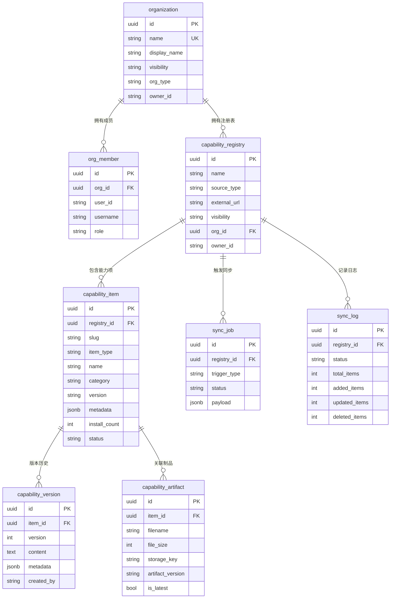
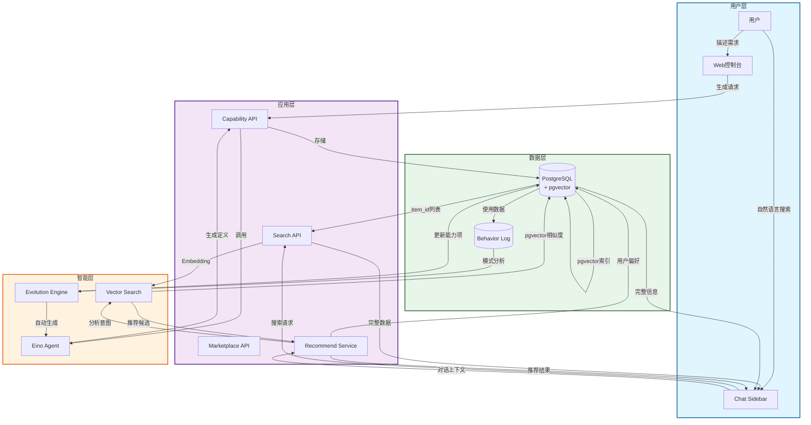
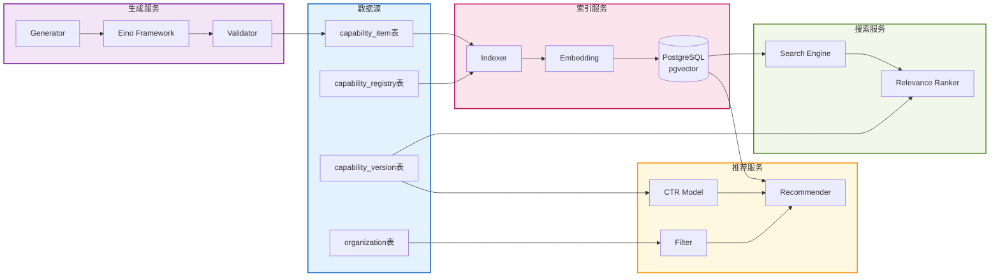
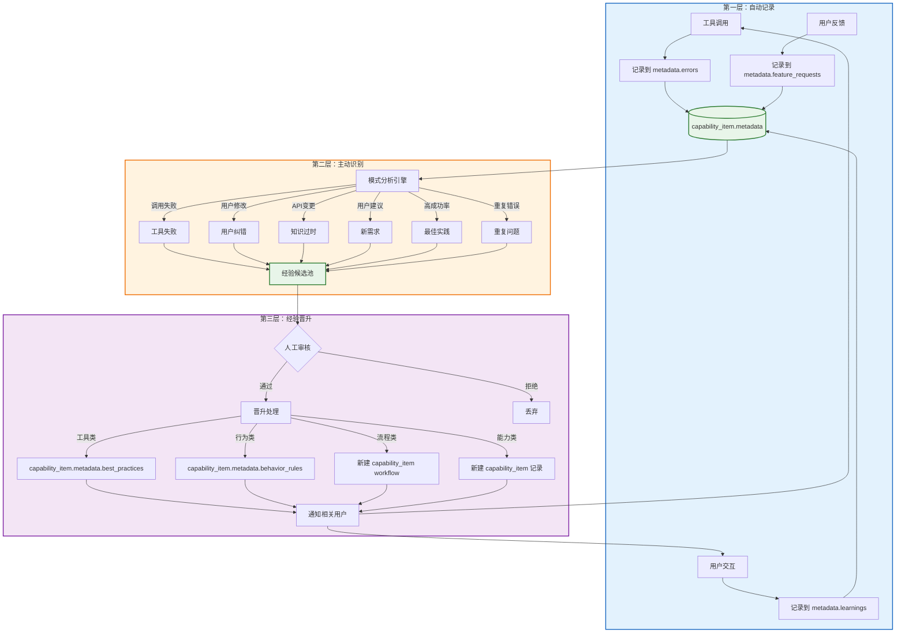
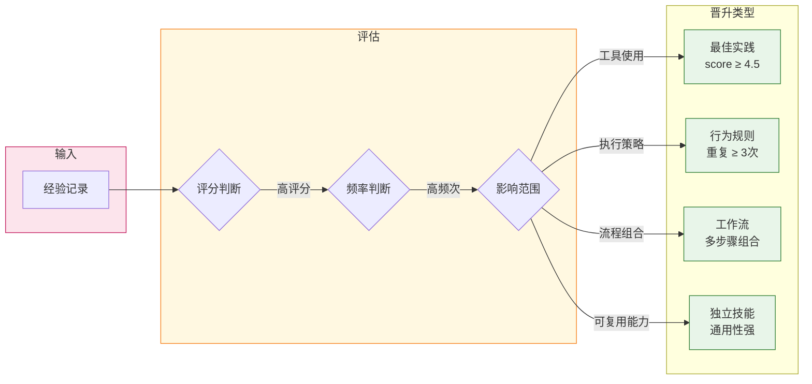

[TOC]

# CoStrict 平台能力落地方案

> 智能技能生成与推荐系统

本文档定义 CoStrict 平台核心能力的落地方案：

**智能技能生成与推荐系统（Skill / MCP 能力生态）**

构建 **能力生产 → 能力推荐 → 经验沉淀 → 能力进化** 的闭环。

---

## 整体架构

```
┌─────────────────────────────────────────────────────────────────────┐
│                         用户浏览器                                    │
│                    (Next.js 16 + React 19)                          │
└────────────────────────┬────────────────────────────────────────────┘
                         │ HTTP/HTTPS
┌────────────────────────┴────────────────────────────────────────────┐
│                    Costrict-Web 应用层                               │
│  ┌────────────────────────────────────────────────────────────────┐ │
│  │              Go Backend (Gin + GORM)                           │ │
│  │  ┌──────────────┐  ┌──────────────┐  ┌──────────────┐          │ │
│  │  │  Auth API    │  │  Org API     │  │  Capability  │          │ │
│  │  │              │  │              │  │     API      │          │ │
│  │  └──────────────┘  └──────────────┘  └──────────────┘          │ │
│  │  ┌──────────────┐  ┌──────────────┐  ┌──────────────┐          │ │
│  │  │  User API    │  │  Registry    │  │  Marketplace │          │ │
│  │  │              │  │     API      │  │     API      │          │ │
│  │  └──────────────┘  └──────────────┘  └──────────────┘          │ │
│  └────────────────────────────────────────────────────────────────┘ │
└────────────────────────┬────────────────────────────────────────────┘
                         │ Casdoor SDK
┌────────────────────────┴────────────────────────────────────────────┐
│                      基础设施层                                       │
│  ┌──────────────┐  ┌──────────────────────┐  ┌──────────────┐       │
│  │   Casdoor    │  │  PostgreSQL pgvector │  │  Eino (LLM)  │       │
│  │  (IAM认证)   │  │ (数据存储 + 语义索引)  │  │ (AI应用框架) │       │
│  └──────────────┘  └──────────────────────┘  └──────────────┘       │
└─────────────────────────────────────────────────────────────────────┘
```

---

## 一、现有系统基础

### 1.1 技术栈

| 层级 | 技术选型 |
|------|----------|
| 前端 | Next.js 16 + React 19 + TypeScript + Tailwind CSS |
| 后端 | Go + Gin + GORM |
| 认证 | Casdoor (Go-based IAM平台) |
| 数据库 | PostgreSQL + pgvector |
| LLM 框架 | cloudwego/eino (Go LLM 应用框架) |
| 状态管理 | React Context + Server Components |

### 1.2 数据模型

#### 现有核心表

| 表名 | 说明 | 主要字段 |
|------|------|----------|
| `organization` | 组织 | id, name, display_name, description, visibility, org_type, owner_id |
| `org_member` | 组织成员 | id, org_id, user_id, username, role |
| `capability_registry` | 能力注册表 | id, name, description, source_type, external_url, visibility, org_id, owner_id |
| `capability_item` | 能力项 | id, registry_id, slug, item_type, name, description, category, version, content, metadata, install_count, status |
| `capability_version` | 能力版本 | id, item_id, version, content, metadata, commit_msg, created_by |
| `capability_artifact` | 能力制品 | id, item_id, filename, file_size, checksum_sha256, storage_key, artifact_version, is_latest |
| `sync_job` | 同步任务 | id, registry_id, trigger_type, status, payload, retry_count, scheduled_at |
| `sync_log` | 同步日志 | id, registry_id, status, total_items, added_items, updated_items, deleted_items |

#### 能力项类型 (item_type)

`capability_item` 表通过 `item_type` 字段统一管理多种能力类型：

| item_type | 说明 | 对应旧模型 |
|-----------|------|------------|
| `skill` | 技能 | 原 `skill` 表 |
| `agent` | Agent | 原 `agent` 表 |
| `command` | 命令 | 原 `command` 表 |
| `mcp_server` | MCP服务器 | 原 `mcp_server` 表 |

#### 能力注册表来源类型 (source_type)

`capability_registry` 表支持多种来源：

| source_type | 说明 |
|-------------|------|
| `internal` | 内部创建 |
| `external` | 外部 Git 仓库同步 |

#### 表关系图



### 1.3 权限模型

#### 角色定义

**组织级别：**
| 角色 | 权限范围 |
|------|----------|
| Owner | 组织所有权限 |
| Admin | 管理组织和仓库 |
| Member | 访问组织资源 |

**仓库级别：**
| 角色 | 权限范围 |
|------|----------|
| Owner | 仓库所有权限 |
| Admin | 管理仓库和技能 |
| Developer | 创建和编辑技能 |
| Viewer | 查看仓库和技能 |

### 1.4 现有 API

#### 能力项管理 API（已有）

| 接口 | 说明 |
|------|------|
| `POST /api/registries/{id}/items` | 创建能力项 |
| `GET /api/registries/{id}/items` | 获取能力项列表 |
| `GET /api/items/{id}` | 获取能力项详情 |
| `PUT /api/items/{id}` | 更新能力项 |
| `DELETE /api/items/{id}` | 删除能力项 |
| `GET /api/items/{id}/versions` | 获取能力项版本列表 |
| `GET /api/items/{id}/artifacts` | 获取能力项制品列表 |

#### 能力注册表 API（已有）

| 接口 | 说明 |
|------|------|
| `POST /api/registries` | 创建能力注册表 |
| `GET /api/registries` | 获取注册表列表 |
| `GET /api/registries/{id}` | 获取注册表详情 |
| `PUT /api/registries/{id}` | 更新注册表 |
| `DELETE /api/registries/{id}` | 删除注册表 |
| `POST /api/registries/{id}/sync` | 触发同步任务 |
| `GET /api/registries/{id}/sync-logs` | 获取同步日志 |

#### 能力市场 API（已有）

| 接口 | 说明 |
|------|------|
| `GET /api/marketplace/items` | 浏览能力市场 |
| `GET /api/marketplace/categories` | 获取能力分类 |
| `GET /api/marketplace/items/trending` | 获取热门能力项 |

---

## 二、智能技能生成与推荐系统

### 2.1 核心目标

降低 Skill / MCP 工具的创建、发现、使用门槛，实现能力的自动化沉淀与复用。

**构建能力闭环：**

```
需求 → 技能生成 → 技能发布 → 使用 → 数据反馈 → 推荐优化 → 自动进化
```

最终形成 **企业级 AI 技能市场（Skill Marketplace）**。

---

### 2.2 整体数据流



---

### 2.3 模块关系图



---

### 2.4 功能场景

#### 场景1：技能发现

**用户需求：** 想要爬取公众号文章，不知道有哪些工具可用

**解决方案：** 技能语义搜索（扩展现有 `GET /api/marketplace/skills` 接口）

| 步骤 | 说明 | 技术实现 |
|------|------|----------|
| 索引建立 | CapabilityItem 元数据 → Embedding → PostgreSQL pgvector | 复用 `capability_item` 表数据 |
| 搜索方式 | 自然语言输入，语义匹配 | 新增 `/api/marketplace/items/search` 接口 |
| 返回结果 | Web Scraper MCP、HTML Parser Skill、HTTP Request Tool | 关联 `capability_registry` 获取注册表信息 |

**数据流：**

```
用户输入 → Embedding → PostgreSQL pgvector 相似度搜索
         → 返回 item_id 列表
         → 关联查询 capability_item + capability_registry + capability_version
         → 返回完整能力项信息
```

---

### 场景2：技能创建

**用户需求：** 想创建一个新的自动化技能，但不知道如何编写

**解决方案：** 技能生成助手（扩展现有 `POST /api/skills` 接口）

| 步骤 | 说明 | 技术实现 |
|------|------|----------|
| 用户输入 | 技能名称、需求描述、依赖工具、输入参数、输出结果 | 前端表单收集 |
| 系统生成 | SKILL.md / skill.json / 调用示例 | LLM 自动生成 |
| 数据存储 | 写入 `capability_item` 表，关联 `capability_registry` | 复用现有数据模型 |
| 后续流程 | 一键提交审核 → 审核通过后自动上线 | 复用 Casdoor 权限验证 |

**CapabilityItem 数据结构：**

```json
{
  "name": "web_scraper",
  "slug": "web-scraper",
  "description": "爬取网页内容并解析",
  "item_type": "skill",
  "version": "1.0.0",
  "registry_id": "registry-uuid",
  "created_by": "user-uuid",
  "visibility": "org",
  "status": "active",
  "metadata": {
    "inputs": ["url"],
    "outputs": ["title", "content"],
    "dependencies": ["http_request", "html_parser"]
  }
}
```

---

### 场景3：智能推荐

**用户需求：** 在对话过程中，希望系统主动推荐相关技能

**解决方案：** 会话实时推荐 + 反馈闭环

| 能力 | 说明 | 技术实现 |
|------|------|----------|
| 实时推荐 | 分析对话内容，Chat Sidebar 自动推荐相关技能 | WebSocket 推送 + Vector Search |
| 反馈闭环 | 埋点用户行为（点击/忽略/成功/失败），优化推荐模型 | 扩展 `capability_item.metadata` 字段 |

**推荐数据来源：**

- `capability_item` 表：能力项基本信息
- `capability_item.metadata` 字段：评分和反馈
- `capability_item.install_count` 字段：安装/使用统计

---

### 场景4：能力沉淀

**用户需求：** 发现团队经常重复执行某些操作，希望自动化

**解决方案：** 自动技能生成

| 步骤 | 说明 | 技术实现 |
|------|------|----------|
| 行为识别 | 分析用户行为日志，挖掘重复模式 | 扩展 `capability_item.metadata` 存储行为数据 |
| 自动生成 | LLM 根据模式生成 Skill 定义 | 写入 `capability_item` 表，`visibility: org` |
| 人工审核 | 提交审核后上线 | 复用 Casdoor 权限流程 |

**示例：** 下载报表 → 解析 → 统计 → 发送邮件 → 自动生成 Report Automation Skill

---

### 场景5：跨团队复用

**用户需求：** A 团队的优秀实践希望推广到 B 团队

**解决方案：** 跨团队能力传播

| 指标 | 说明 | 数据来源 |
|------|------|----------|
| 识别标准 | 调用次数、成功率、复用率 | `capability_item.install_count`、`metadata` |
| 传播方式 | 自动推荐给同领域团队 | 关联 `organization`、`org_member` 表 |

---

### 2.3 自我进化机制

为了避免重复踩坑，系统内置 **三层经验沉淀机制**，实现技能的自动学习和进化。

#### 整体流程图



#### 晋升决策流程



#### 三层机制详解

**第一层：自动记录**

| 记录类型 | 字段 | 触发条件 |
|----------|------|----------|
| 错误记录 | `metadata.errors: [{ timestamp, context, message, resolution }]` | 工具调用失败 |
| 学习记录 | `metadata.learnings: [{ timestamp, insight, impact }]` | 用户交互/纠错 |
| 需求记录 | `metadata.feature_requests: [{ timestamp, request, status }]` | 用户反馈 |

**第二层：主动识别**

系统识别6类学习场景：

| 场景 | 记录位置 | 触发条件 |
|------|----------|----------|
| 工具失败 | capability_item.metadata.errors | 调用返回错误 |
| 用户纠错 | capability_item.metadata.learnings | 用户修改输出 |
| 知识过时 | capability_item.metadata.learnings | API 变更检测 |
| 新需求 | capability_item.metadata.feature_requests | 用户反馈 |
| 最佳实践 | capability_item.metadata.learnings | 高成功率模式 |
| 重复问题 | capability_item.metadata.learnings | 相同错误多次出现 |

**第三层：经验晋升**

经验自动升级为系统规则：

| 类型 | 存储位置 | 说明 |
|------|----------|------|
| 工具最佳实践 | `capability_item.metadata.best_practices` | 推荐给所有用户 |
| 行为规则 | `capability_item.metadata.behavior_rules` | Agent 执行策略 |
| 工作流 | 新建 `capability_item` (item_type=workflow) | 可复用的流程 |
| 通用能力 | 新建 `capability_item` 记录 | 提取为独立技能 |

---

## 三、新增 API 设计

### 能力项搜索 API（扩展）

| 方法 | 路径 | 说明 |
|------|------|------|
| POST | `/api/marketplace/items/search` | 语义搜索能力项 |
| POST | `/api/marketplace/items/recommend` | 获取推荐能力项 |
| POST | `/api/marketplace/items/generate` | 智能生成能力项 |
| GET | `/api/marketplace/items/{id}/versions` | 获取能力项版本列表 |
| GET | `/api/marketplace/items/{id}/artifacts` | 获取能力项制品列表 |

---

## 四、整体技术复用

### 复用现有能力

| 能力 | 现有组件 | 新功能复用 |
|------|----------|------------|
| 认证授权 | Casdoor | 权限验证 |
| 组织管理 | Casdoor Organization + org_member 表 | 能力项组织归属 |
| 能力管理 | CapabilityItem/CapabilityRegistry 表 | 能力项语义索引数据源 |
| 能力市场 | Marketplace API | 语义搜索扩展 |
| 用户偏好 | capability_item.metadata 字段 | 推荐算法输入 |
| 版本管理 | CapabilityVersion 表 | 能力项版本控制 |
| 制品管理 | CapabilityArtifact 表 | 能力项附件存储 |
| 外部同步 | SyncJob/SyncLog 表 | 外部 Git 仓库同步 |

### 新增模块

| 模块 | 技术选型 | 说明 |
|------|----------|------|
| Vector Store | PostgreSQL pgvector | 技能语义索引（复用现有数据库） |
| LLM 框架 | [cloudwego/eino](https://github.com/cloudwego/eino) | Go 语言 LLM 应用开发框架 |
| Embedding | eino-ext (OpenAI/Ark) | 文本向量化 |

#### eino 框架说明

[eino](https://github.com/cloudwego/eino) 是字节跳动 cloudwego 团队开发的 Go 语言 LLM 应用框架，类似 LangChain。

**核心特性：**

| 特性 | 说明 |
|------|------|
| Components | ChatModel, Tool, Retriever, Embedding 等可复用组件 |
| Agent Development Kit | 构建 AI agents，支持 tool use、多 agent 协作 |
| Composition | 将组件连接成图和工作流 |
| Stream Processing | 自动处理流式响应 |
| Callback Aspects | 日志、追踪、指标注入 |

**支持的后端：**

- OpenAI (GPT-4, GPT-4o)
- Anthropic (Claude)
- Google (Gemini)
- 字节跳动 (Ark)
- Ollama (本地模型)

**使用示例：**

```go
import (
    "github.com/cloudwego/eino-ext/components/model/openai"
    "github.com/cloudwego/eino/flow/adk"
)

// 配置 ChatModel
chatModel, _ := openai.NewChatModel(ctx, &openai.ChatModelConfig{
    Model:  "gpt-4o",
    APIKey: os.Getenv("OPENAI_API_KEY"),
})

// 创建 Agent
agent, _ := adk.NewChatModelAgent(ctx, &adk.ChatModelAgentConfig{
    Model: chatModel,
    ToolsConfig: adk.ToolsConfig{
        ToolsNodeConfig: compose.ToolsNodeConfig{
            Tools: []tool.BaseTool{skillGeneratorTool},
        },
    },
})
```

---

## 五、整体能力闭环

最终平台形成完整闭环：

```
用户需求
   ↓
能力生成 (Eino Agent + capability_item 表)
   ↓
能力推荐 (Vector Search + Marketplace API)
   ↓
经验沉淀 (三层学习机制)
   ↓
能力自动进化 (capability_item.metadata 更新)
```

**平台定位升级：**

- 从：**AI工具**
- 到：**AI能力操作系统**

