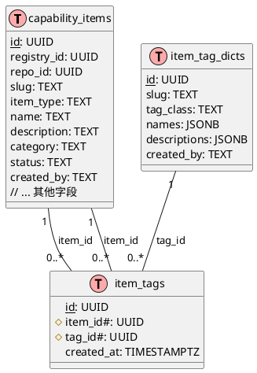
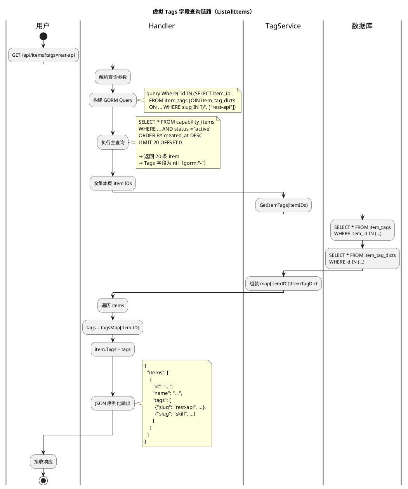

# Capability Item 多标签支持设计

## 1. 概述

本文档描述 capability item 多标签支持的设计与实现。在此之前，item 仅通过单一的 `item_type`（如 `skill`、`mcp`、`command`）和一个可选的 `category` 进行分类。新的标签系统允许一个 item 携带多个不同类别的标签，从而实现更丰富的过滤、组织和发现能力。

## 2. 目标

- 支持 capability item 拥有多个标签。
- 支持标签分类：`system`、`functional`、`custom`。
- 在 item 列表 API 中支持基于标签的过滤。
- 在注册表同步时，自动从 `SKILLMD` 和 `plugin.json` 的 frontmatter 中提取标签。
- 在直接创建 item（JSON / 文件上传）时支持设置标签。
- 提供支持国际化的标签字典（名称和描述使用 JSONB 存储）。
- 保持与现有 `item_type` 和 `category` 字段的向后兼容。

## 3. 数据模型与表关系

### 3.1 标签字典表（`item_tag_dicts`）

存储所有唯一的标签及其元数据。

| 字段           | 类型        | 说明                                              |
|----------------|-------------|---------------------------------------------------|
| `id`           | UUID        | 主键，自动生成。                                  |
| `slug`         | TEXT        | 唯一标识符（如 `skill`、`http-client`）。         |
| `tag_class`    | TEXT        | `system` \| `functional` \| `custom`。            |
| `names`        | JSONB       | 本地化名称：`{"en":"Skill","zh":"技能"}`。 |
| `descriptions` | JSONB       | 本地化描述。                                      |
| `created_by`   | TEXT        | `system` 或用户 ID。                              |
| `created_at`   | TIMESTAMPTZ |                                                   |
| `updated_at`   | TIMESTAMPTZ |                                                   |

### 3.2 Item-标签关联表（`item_tags`）

多对多连接表，将 item 与标签关联。

| 字段        | 类型        | 说明                               |
|-------------|-------------|------------------------------------|
| `id`        | UUID        | 主键。                             |
| `item_id`   | UUID        | 外键 → `capability_items.id`。     |
| `tag_id`    | UUID        | 外键 → `item_tag_dicts.id`。       |
| `created_at`| TIMESTAMPTZ |                                    |

**约束：**
- (`item_id`, `tag_id`) 唯一索引，防止重复。
- 外键使用 `ON DELETE CASCADE` 级联删除。
- `tag_id` 索引，支持反向查询。

### 3.3 CapabilityItem 模型更新

`CapabilityItem` 结构体增加一个虚拟 `Tags` 字段：

```go
type CapabilityItem struct {
    // ... 已有字段 ...
    Tags []ItemTagDict `gorm:"-" json:"tags,omitempty"`
}
```

该字段**不**由 GORM 持久化（`gorm:"-"`）。在查询时通过批量加载填充，并在 API 响应中序列化。

### 3.4 数据表关系图



**关系说明：**

- `capability_items` 与 `item_tag_dicts` 之间通过 `item_tags` 建立**多对多**关系。
- 一个 item 可以拥有**零个或多个**标签。
- 一个标签可以被**多个 item** 共享使用。
- `item_tags` 作为纯关联表，仅维护 `item_id` → `tag_id` 的映射，不包含业务字段。
- 外键约束设置为 `ON DELETE CASCADE`：删除 item 或删除 tag 时，关联记录自动清理，无需应用层手动处理。

## 4. 标签分类

| 分类           | 说明                                                              | 示例                              |
|----------------|-------------------------------------------------------------------|-----------------------------------|
| `system`       | 从 `item_type` 派生的内置标签，由系统自动管理。                    | `skill`、`mcp`、`command`、`hook` |
| `functional`   | 从 `category` 字段或同步时 frontmatter 的 `tags` 提取的标签。       | `http-client`、`data-processing` |
| `custom`       | 用户通过 API 创建，或从 API 调用中的未知 slug 自动生成的标签。      | `team-alpha`、`wip`               |

## 5. 数据库迁移

迁移文件：`server/migrations/20260422100000_create_item_tags.sql`

### 5.1 Up 阶段

1. **创建表**：`item_tag_dicts` 和 `item_tags`，包含索引和外键。
2. **预置 system 标签**：为每个 `item_type` 值插入预定义标签：
   - `skill`、`mcp`、`command`、`subagent`、`hook`
3. **生成 functional 标签**：从现有 `capability_items` 中的不同 `category` 值自动生成标签。
4. **回刷关联数据**：根据 `item_type` 将所有现有活跃 item 关联到对应的 system 标签。

### 5.2 Down 阶段

按顺序删除两张表（先 `item_tags`，再 `item_tag_dicts`）。

## 6. 服务层（TagService）

位置：`server/internal/services/tag_service.go`

### 6.1 核心方法

```go
type TagService struct {
    DB *gorm.DB
}
```

#### EnsureTags

```go
func (s *TagService) EnsureTags(slugs []string, tagClass, createdBy string) ([]models.ItemTagDict, error)
```

- 对输入 slug 去重并去除空白。
- 按 slug 查询已有标签。
- 为缺失的标签创建记录，默认名称格式为 `{"en": slug}`。
- 优雅处理并发创建冲突（遇到重复键则重新查询）。
- 按输入顺序返回解析后的标签记录。

#### SetItemTags

```go
func (s *TagService) SetItemTags(itemID string, tagIDs []string) error
```

- 在事务中执行。
- 先删除该 item 的所有现有标签关联。
- 插入新的关联记录，忽略重复项。

#### GetItemTags

```go
func (s *TagService) GetItemTags(itemIDs []string) (map[string][]models.ItemTagDict, error)
```

- 批量查询多个 item 的标签关联。
- 批量加载标签字典记录。
- 返回 `itemID → []ItemTagDict` 的映射，便于高效填充。

### 6.2 CRUD 操作

- `List(tagClass)` — 列出所有标签，可按分类过滤。
- `Get(id)` / `GetBySlug(slug)` — 查询单个标签。
- `Create(req, createdBy)` — 创建新标签。
- `Update(id, req)` — 修改名称、描述或分类。
- `Delete(id)` — 删除标签及其所有 item 关联（事务内执行）。

## 7. 文件解析

位置：`server/internal/services/parser_service.go`

`ParsedItem` 结构体新增 `Tags []string` 字段。

### 7.1 SKILLMD 解析

读取 frontmatter 中的 `tags` 键（字符串数组）：

```yaml
---
name: My Skill
category: http-client
tags:
  - rest-api
  - authentication
---
```

### 7.2 Plugin JSON 解析

从 `plugin.json` 中读取 `tags` 数组字段：

```json
{
  "name": "My Plugin",
  "category": "data-processing",
  "tags": ["etl", "pipeline"]
}
```

## 8. 注册表同步集成

位置：`server/internal/services/sync_service.go`

在 `SyncRegistry` 中解析 item 后（无论是新建还是更新）：

1. 如果 `parsed.Tags` 非空，调用 `EnsureTags(parsed.Tags, TagClassFunctional, triggerUser)`。
2. 收集返回的标签 ID。
3. 调用 `SetItemTags(itemID, tagIDs)` 建立关联。

这确保了源文件中的标签能够自动反映到数据库中，无需人工干预。

## 9. 创建 Item 时设置标签

除了注册表同步，直接创建 item 的两种入口也支持标签设置。

### 9.1 JSON 直接创建

接口：`POST /api/items`

请求体新增 `tags` 字段：

```json
{
  "itemType": "skill",
  "name": "My Skill",
  "tags": ["rest-api", "authentication"]
}
```

- `tags` 为可选的 slug 字符串数组。
- 后端调用 `EnsureTags(slugs, TagClassCustom, createdBy)` 自动创建不存在的标签。
- 随后调用 `SetItemTags(itemID, tagIDs)` 建立 item-tag 关联。
- 标签在用户提交后立即绑定，无需二次调用。

### 9.2 文件上传创建

接口：`POST /api/items`（`multipart/form-data`）

上传的 archive（`.zip` / `.tar.gz`）中包含 `SKILLMD` 或 `plugin.json` 时，解析器会从 frontmatter 中提取 `tags`：

```yaml
---
name: My Skill
tags:
  - rest-api
  - authentication
---
```

- `ParseArchive` 返回的 `Parsed.Tags` 会被自动提取。
- 后端调用 `EnsureTags(slugs, TagClassFunctional, createdBy)` 创建/获取标签。
- 随后调用 `SetItemTags(itemID, tagIDs)` 建立关联。

**注意**：文件上传方式不额外提供表单字段传 tags，完全依赖 frontmatter 自动提取。如需覆盖，可在创建后调用 `POST /api/items/:id/tags` 修改。

## 10. API 设计

### 10.1 标签字典（公开读取）

| 方法 | 接口           | 说明                                |
|------|----------------|-------------------------------------|
| GET  | `/api/tags`    | 列出所有标签。Query: `?tagClass=`   |
| GET  | `/api/tags/:id`| 按 ID 查询单个标签。                |

### 10.2 Item 创建时设置标签

| 方法 | 接口            | 说明                        |
|------|-----------------|-----------------------------|
| POST | `/api/items`    | JSON 创建 item，请求体支持 `tags: ["slug1"]`。 |
| POST | `/api/items`    | 文件上传创建，从 archive frontmatter 自动提取 tags。 |

### 10.3 标签管理（需认证）

| 方法   | 接口            | 说明                       |
|--------|-----------------|----------------------------|
| POST   | `/api/tags`     | 创建新标签。               |
| PUT    | `/api/tags/:id` | 更新已有标签。             |
| DELETE | `/api/tags/:id` | 删除标签及其所有关联。     |

### 10.4 Item 标签分配

| 方法 | 接口                  | 请求体                                    |
|------|-----------------------|-------------------------------------------|
| POST | `/api/items/:id/tags` | `{"tagIds": ["uuid1", "uuid2"]}` 或 `{"tags": ["slug1", "slug2"]}` |

- 如果提供 `tags`（slug 列表），不存在的 slug 会通过 `EnsureTags` 自动创建为 `custom` 类标签。
- 如果提供 `tagIds`，会验证其是否存在于字典中。
- 返回该 item 更新后的标签列表。

### 10.5 Item 列表过滤

公开和个人 item 列表接口均支持标签过滤：

- `GET /api/marketplace/items?tags=rest-api,authentication`
- `GET /api/registry/:id/items?tags=mcp,hook`

过滤条件通过关联表对 `item_tag_dicts.slug` 执行 `IN` 查询。

#### 多标签过滤语义

当前实现采用 **OR 语义**：传入多个 tag slug（逗号分隔）时，只要 item 拥有其中**任意一个**标签即被命中。

例如 `?tags=rest-api,auth` 生成的 SQL：

```sql
id IN (
    SELECT item_id
    FROM item_tags
    JOIN item_tag_dicts ON item_tags.tag_id = item_tag_dicts.id
    WHERE item_tag_dicts.slug IN ('rest-api', 'auth')
)
```

#### AND 语义（精确交集）

若业务需要「**同时满足所有指定标签**」的精确匹配，应改用 `GROUP BY + HAVING`：

```sql
id IN (
    SELECT item_id
    FROM item_tags
    JOIN item_tag_dicts ON item_tags.tag_id = item_tag_dicts.id
    WHERE item_tag_dicts.slug IN ('rest-api', 'auth')
    GROUP BY item_id
    HAVING COUNT(DISTINCT item_tag_dicts.slug) = 2
)
```

对应的 GORM 代码：

```go
tagSlugs := strings.Split(tags, ",")
query = query.Where(
    `id IN (
        SELECT item_id
        FROM item_tags
        JOIN item_tag_dicts ON item_tags.tag_id = item_tag_dicts.id
        WHERE item_tag_dicts.slug IN ?
        GROUP BY item_id
        HAVING COUNT(DISTINCT item_tag_dicts.slug) = ?
    )`,
    tagSlugs, len(tagSlugs),
)
```

| 语义 | 适用场景 |
|------|----------|
| **OR**（当前默认） | 扩大召回面，推荐「与 API 或认证相关的 item」 |
| **AND**（精确匹配） | 严格筛选「同时具备 API 和认证能力的 item」 |

### 10.6 语义搜索中的标签过滤

当前 `SemanticSearch` 与 `HybridSearch` 的 `SearchRequest` 尚未包含 `Tags` 字段，因此**语义/混合搜索暂不支持按标签过滤**。如需支持，需在 `SearchRequest` 中增加 `Tags []string`，并在 SQL 拼接阶段加入与列表过滤相同的 `IN` 子查询条件。

### 10.7 响应增强

Item 列表响应现在包含已填充的 `tags` 数组：

```json
{
  "items": [
    {
      "id": "...",
      "name": "My Skill",
      "tags": [
        {
          "id": "...",
          "slug": "skill",
          "tagClass": "system",
          "names": {"en": "Skill", "zh": "技能"}
        },
        {
          "id": "...",
          "slug": "rest-api",
          "tagClass": "functional",
          "names": {"en": "rest-api"}
        }
      ]
    }
  ]
}
```

## 11. 虚拟 Tags 字段查询链路详解

### 11.1 字段定义与特性

`CapabilityItem.Tags` 是一个**虚拟字段**：

```go
type CapabilityItem struct {
    // ... 数据库持久化字段 ...
    Tags []ItemTagDict `gorm:"-" json:"tags,omitempty"`
}
```

- `gorm:"-"`：GORM **完全忽略**这个字段。建表、INSERT、UPDATE、SELECT 时都不涉及它。
- `json:"tags,omitempty"`：JSON 序列化时输出为 `"tags"`，为空时省略。

**为什么不用 GORM 自动多对多关联？**

如果配置 `gorm:"many2many:item_tags"`，GORM 的 `Preload("Tags")` 虽然能自动加载，但存在以下问题：

1. **N+1 风险**：列表查询时若忘记 Preload，访问 `item.Tags` 会触发懒加载，导致严重性能问题。
2. **控制粒度不足**：无法自定义关联表的查询条件（如按 `tag_class` 过滤），也无法控制加载时机。
3. **分页失真**：如果用 `JOIN` 做一次性查询，`capability_items` 的行会被 tag 数量**放大**（一个 item 有 3 个 tag 就返回 3 行），导致 `LIMIT 20` 实际只返回 7-8 个不同的 item。

因此采用「**虚拟字段 + 批量手动填充**」的方案。

### 11.2 批量加载流程

以 `ListAllItems` 为例，虚拟 `Tags` 字段的填充分为两个阶段：

**阶段一：主查询（不含 tags）**

```go
// GORM 查询 capability_items，Tags 字段被忽略（值为 nil）
query.Preload("Registry").Limit(20).Offset(0).Find(&items)
```

生成的 SQL：

```sql
SELECT * FROM capability_items
WHERE registry_id IN (...)
  AND status = 'active'
ORDER BY created_at DESC
LIMIT 20 OFFSET 0;
```

此时 `items` 中每个元素的 `Tags` 都是 `nil`。

**阶段二：批量加载 tags**

```go
// 收集本页所有 item ID
itemIDs := make([]string, len(items))
for i, item := range items {
    itemIDs[i] = item.ID
}

// 一次性批量查询这些 item 的标签
tagsMap, _ = TagSvc.GetItemTags(itemIDs)
```

`GetItemTags` 内部执行两条 SQL：

```sql
-- 第 1 条：查关联表
SELECT * FROM item_tags WHERE item_id IN ('id1', 'id2', ...);

-- 第 2 条：查字典表
SELECT * FROM item_tag_dicts WHERE id IN ('tagId1', 'tagId2', ...);
```

然后组装成 `map[itemID][]ItemTagDict` 返回。

**阶段三：手动赋值到响应结构体**

```go
type ItemWithRepo struct {
    models.CapabilityItem
    RepoName  string `json:"repoName,omitempty"`
    Favorited bool   `json:"favorited"`
}
out := make([]ItemWithRepo, len(items))
for i, item := range items {
    out[i] = ItemWithRepo{CapabilityItem: item, Favorited: favoritedSet[item.ID]}
    if tagsMap != nil {
        out[i].Tags = tagsMap[item.ID]  // ← 虚拟字段在这里被赋值
    }
}
c.JSON(200, gin.H{"items": out})
```

### 11.3 活动图



### 11.4 为什么分两步查询而不是 JOIN

如果尝试用一条 SQL JOIN 同时返回 item 和 tags：

```sql
SELECT ci.*, itd.*
FROM capability_items ci
JOIN item_tags it ON it.item_id = ci.id
JOIN item_tag_dicts itd ON itd.id = it.tag_id
WHERE ci.status = 'active'
LIMIT 20;
```

假设每个 item 平均有 3 个 tag，结果集会变成 **60 行**（20 item × 3 tags），且 `ci.*` 列在每个 tag 行上重复。

这会导致：
- `LIMIT 20` 实际只返回约 **7 个不同的 item**（60 / 3 = 20 行被 tag 数量稀释）。
- GORM `Find` 无法正确去重和映射到结构体数组。
- 内存中数据冗余（item 基础字段重复 N 次）。

而分两步的方案：
- 第一步精确返回 **20 个 item**（分页不受影响）。
- 第二步用 **2 条 SQL** 批量加载所有 tags，总查询次数固定为 3 次，与 item 数量无关。

### 11.5 消费者

前端接收到的 JSON 中，`tags` 数组可用于：

1. **展示**：在每个 item 卡片下方渲染标签 badge
2. **交互**：点击标签跳转到 `?tags=slug` 过滤同类型 item
3. **搜索**：结合标签过滤接口实现多维度检索

**当前覆盖范围：**

| 接口 | 是否填充 Tags |
|------|---------------|
| `GET /api/items`（ListAllItems） | 是 |
| `GET /api/registry/:id/items`（ListMyItems） | 否（MyItem 结构体未继承 Tags） |
| `GET /api/items/:id`（GetItem） | 否 |
| `POST /api/items`（CreateItemDirect） | 否（响应未二次查询） |

如需在更多接口中展示 tags，只需在对应 handler 中复用相同的「收集 IDs → GetItemTags → 赋值」模式。

## 12. Handler 集成

### 12.1 ItemHandler

`NewItemHandler` 现在接受 `*services.TagService` 参数。`ItemHandler` 使用它进行：
- 列表查询时的标签批量加载（`GetItemTags`）。
- 将标签附加到响应结构体。
- JSON / 文件上传创建 item 时设置标签（`EnsureTags` + `SetItemTags`）。

### 12.2 全局服务引用

`TagSvc` 作为包级变量在 `handlers/sync.go` 中注册，并在 `main.go` 中赋值，与 `CategorySvc` 类似。

## 13. 依赖注入

在 `server/cmd/api/main.go` 中：

```go
tagSvc := &services.TagService{DB: db}
handlers.TagSvc = tagSvc
itemHandler := handlers.NewItemHandler(db, indexerSvc, parserSvc, categorySvc, tagSvc)
```

注册路由：

```go
api.GET("/tags", handlers.ListTagsHandler(tagSvc))
api.GET("/tags/:id", handlers.GetTagHandler(tagSvc))
// (POST、PUT、DELETE 按现有权限中间件配置)
```

## 14. Item 删除时的清理

删除 item 时（`capability_item.go` 中的 `DeleteItem`），由于外键约束设置了 `ON DELETE CASCADE`，`item_tags` 关联记录会自动级联删除，无需手动处理。

## 15. 关键设计决策

### 15.1 CapabilityItem 上的虚拟 Tags 字段

未使用 GORM 的自动多对多关联，而是将 `Tags` 字段标记为 `gorm:"-"`，并通过 `GetItemTags` 显式填充。这避免了非预期的懒加载查询，并在列表 API 中实现对批量获取的完全控制。

### 15.2 面向 Slug 的外部接口

API 对外使用标签 slug（人类可读的字符串）进行过滤和分配，内部关联则使用 UUID。这使得 URL 和 frontmatter 更具可读性和稳定性。

### 15.3 EnsureTags 自动创建

文件或 API 调用中引用的标签若不存在会自动创建。这消除了"先创建标签再使用"的额外流程，确保同步过程无缝衔接。

### 15.4 标签分类隔离

`tag_class` 字段防止用户定义的标签与系统语义冲突。system 标签由迁移和同步逻辑管理；custom 标签由用户驱动创建。

### 15.5 向后兼容

现有的 `item_type` 和 `category` 列保持不变。system 标签从 `item_type` 派生，functional 标签可从 `category` 派生，但这两个字段均未被移除或修改，现有查询继续正常工作。

## 16. 文件变更清单

| 文件 | 变更 |
|------|------|
| `server/internal/models/models.go` | 增加 `ItemTagDict`、`ItemTag` 模型；为 `CapabilityItem` 增加虚拟 `Tags` 字段。 |
| `server/internal/services/tag_service.go` | **新增。** 标签服务完整实现。 |
| `server/internal/services/parser_service.go` | 从 SKILLMD 和 plugin.json 解析 `tags` 数组。 |
| `server/internal/services/sync_service.go` | 注册表同步期间自动创建/关联标签。 |
| `server/internal/handlers/tag.go` | **新增。** 标签 CRUD 及 item 标签分配 handler。 |
| `server/internal/handlers/capability_item.go` | 注入 `TagService`；增加标签过滤和响应增强；JSON/文件上传创建 item 时支持设置标签。 |
| `server/internal/handlers/capability_item_test.go` | 修复 `NewItemHandler` 构造函数调用，适配新增 tagSvc 参数。 |
| `server/internal/handlers/capability_registry.go` | 在注册表 item 列表中增加 `?tags` 查询过滤。 |
| `server/internal/handlers/sync.go` | 增加 `TagSvc` 全局引用。 |
| `server/cmd/api/main.go` | 初始化 `TagService`，注入 handler，注册路由。 |
| `server/migrations/20260422100000_create_item_tags.sql` | **新增。** 表、索引、种子数据和回刷的迁移脚本。 |
