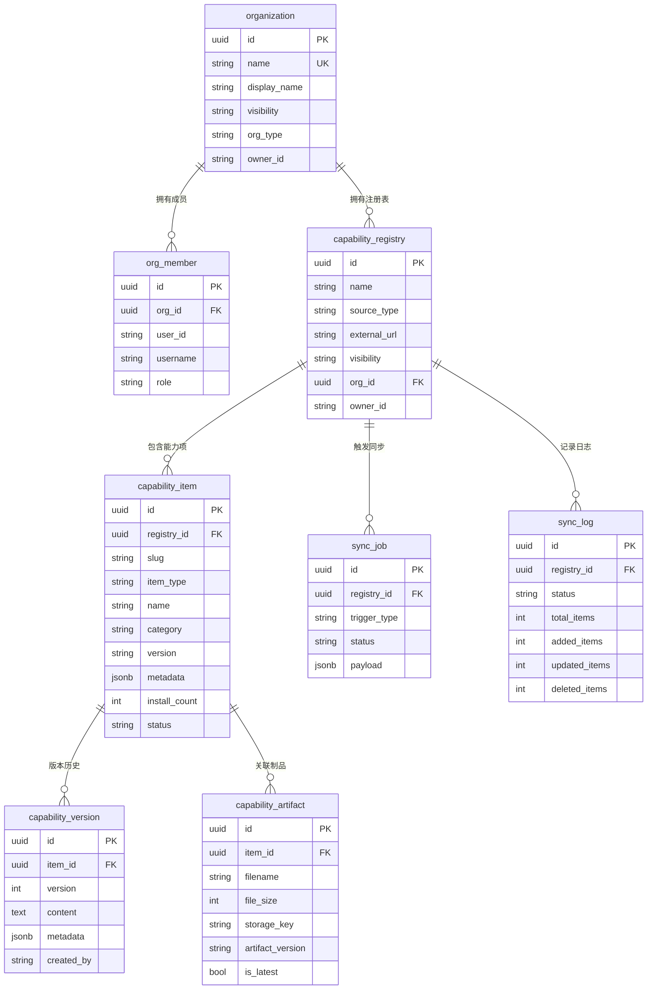
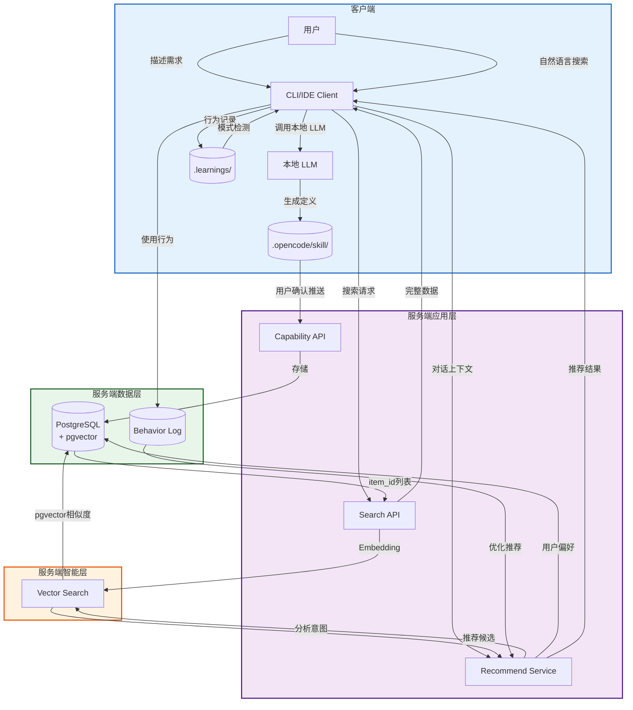
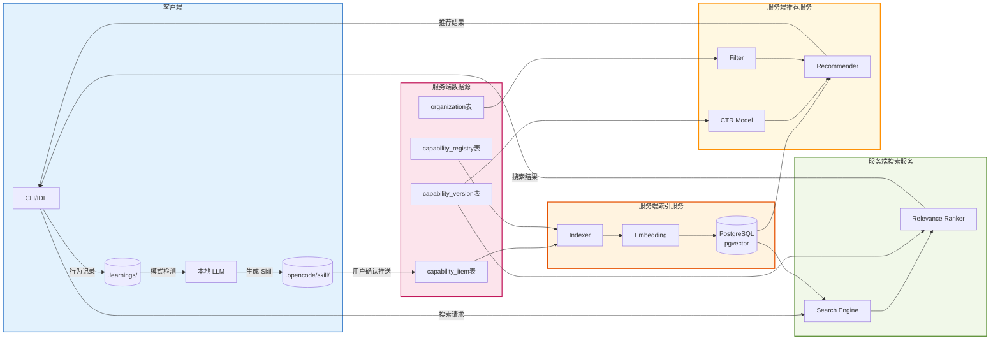
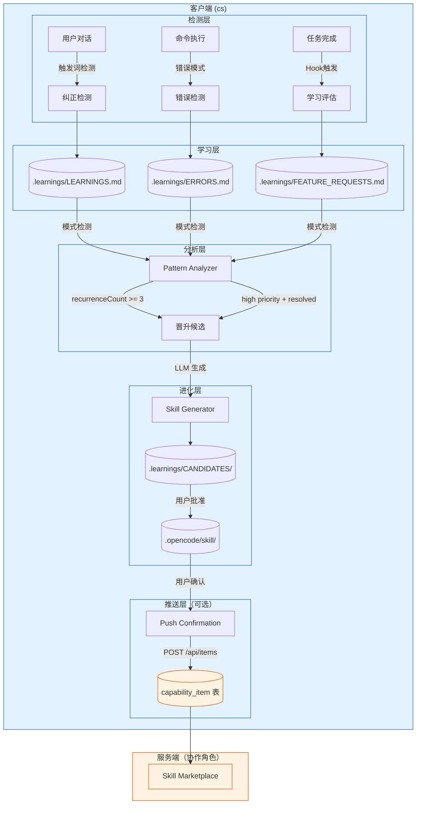
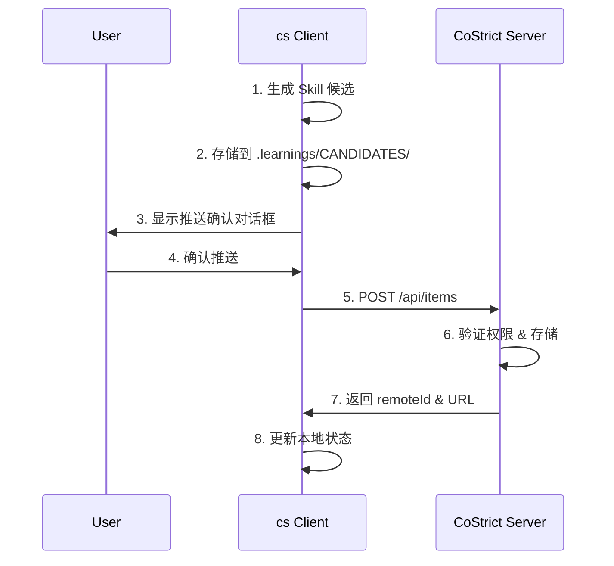

> **实现状态：服务端已完成，客户端自演化待确认**
>
> - 状态：✅ 服务端已完成 / ⚠️ 客户端自演化（`.learnings/`）属于 opencode CLI 独立仓库，未在本仓库验证
> - 实现位置：`server/internal/services/`（`recommend_service.go`, `search_service.go`, `embedding_service.go`, `behavior_service.go`, `generate_service.go`）
> - 说明：智能技能生成与推荐系统的服务端部分已完整实现，包括向量嵌入、行为分析、搜索和推荐。客户端侧的技能自演化功能（`.learnings/` 目录管理）属于 opencode CLI 范畴，不在本仓库中。

---

[TOC]

# CoStrict 平台能力落地方案

> 智能技能生成与推荐系统

本文档定义 CoStrict 平台核心能力的落地方案：

**智能技能生成与推荐系统（Skill / MCP 能力生态）**

构建 **能力生产 → 能力推荐 → 经验沉淀 → 能力进化** 的闭环。

---

## 整体架构

```
┌─────────────────────────────────────────────────────────────────────┐
│                         用户浏览器                                    │
│                    (Next.js 16 + React 19)                          │
└────────────────────────┬────────────────────────────────────────────┘
                         │ HTTP/HTTPS
┌────────────────────────┴────────────────────────────────────────────┐
│                    Costrict-Web 应用层                               │
│  ┌────────────────────────────────────────────────────────────────┐ │
│  │              Go Backend (Gin + GORM)                           │ │
│  │  ┌──────────────┐  ┌──────────────┐  ┌──────────────┐          │ │
│  │  │  Auth API    │  │  Org API     │  │  Capability  │          │ │
│  │  │              │  │              │  │     API      │          │ │
│  │  └──────────────┘  └──────────────┘  └──────────────┘          │ │
│  │  ┌──────────────┐  ┌──────────────┐  ┌──────────────┐          │ │
│  │  │  User API    │  │  Registry    │  │  Marketplace │          │ │
│  │  │              │  │     API      │  │     API      │          │ │
│  │  └──────────────┘  └──────────────┘  └──────────────┘          │ │
│  └────────────────────────────────────────────────────────────────┘ │
└────────────────────────┬────────────────────────────────────────────┘
                         │ Casdoor SDK
┌────────────────────────┴────────────────────────────────────────────┐
│                      基础设施层                                       │
│  ┌──────────────┐  ┌──────────────────────┐  ┌──────────────┐       │
│  │   Casdoor    │  │  PostgreSQL pgvector │  │  Eino (LLM)  │       │
│  │  (IAM认证)   │  │ (数据存储 + 语义索引)  │  │ (AI应用框架) │       │
│  └──────────────┘  └──────────────────────┘  └──────────────┘       │
└─────────────────────────────────────────────────────────────────────┘
```

---

## 一、现有系统基础

### 1.1 技术栈

| 层级 | 技术选型 |
|------|----------|
| 前端 | Next.js 16 + React 19 + TypeScript + Tailwind CSS |
| 后端 | Go + Gin + GORM |
| 认证 | Casdoor (Go-based IAM平台) |
| 数据库 | PostgreSQL + pgvector |
| LLM 框架 | cloudwego/eino (Go LLM 应用框架) |
| 状态管理 | React Context + Server Components |

### 1.2 数据模型

#### 现有核心表

| 表名 | 说明 | 主要字段 |
|------|------|----------|
| `organization` | 组织 | id, name, display_name, description, visibility, org_type, owner_id |
| `org_member` | 组织成员 | id, org_id, user_id, username, role |
| `capability_registry` | 能力注册表 | id, name, description, source_type, external_url, visibility, org_id, owner_id |
| `capability_item` | 能力项 | id, registry_id, slug, item_type, name, description, category, version, content, metadata, install_count, status |
| `capability_version` | 能力版本 | id, item_id, version, content, metadata, commit_msg, created_by |
| `capability_artifact` | 能力制品 | id, item_id, filename, file_size, checksum_sha256, storage_key, artifact_version, is_latest |
| `sync_job` | 同步任务 | id, registry_id, trigger_type, status, payload, retry_count, scheduled_at |
| `sync_log` | 同步日志 | id, registry_id, status, total_items, added_items, updated_items, deleted_items |

#### 能力项类型 (item_type)

`capability_item` 表通过 `item_type` 字段统一管理多种能力类型：

| item_type | 说明 | 对应旧模型 |
|-----------|------|------------|
| `skill` | 技能 | 原 `skill` 表 |
| `agent` | Agent | 原 `agent` 表 |
| `command` | 命令 | 原 `command` 表 |
| `mcp_server` | MCP服务器 | 原 `mcp_server` 表 |

#### 能力注册表来源类型 (source_type)

`capability_registry` 表支持多种来源：

| source_type | 说明 |
|-------------|------|
| `internal` | 内部创建 |
| `external` | 外部 Git 仓库同步 |

#### 表关系图



### 1.3 权限模型

#### 角色定义

**组织级别：**
| 角色 | 权限范围 |
|------|----------|
| Owner | 组织所有权限 |
| Admin | 管理组织和仓库 |
| Member | 访问组织资源 |

**仓库级别：**
| 角色 | 权限范围 |
|------|----------|
| Owner | 仓库所有权限 |
| Admin | 管理仓库和技能 |
| Developer | 创建和编辑技能 |
| Viewer | 查看仓库和技能 |

### 1.4 现有 API

#### 能力项管理 API（已有）

| 接口 | 说明 |
|------|------|
| `POST /api/registries/{id}/items` | 创建能力项 |
| `GET /api/registries/{id}/items` | 获取能力项列表 |
| `GET /api/items/{id}` | 获取能力项详情 |
| `PUT /api/items/{id}` | 更新能力项 |
| `DELETE /api/items/{id}` | 删除能力项 |
| `GET /api/items/{id}/versions` | 获取能力项版本列表 |
| `GET /api/items/{id}/artifacts` | 获取能力项制品列表 |

#### 能力注册表 API（已有）

| 接口 | 说明 |
|------|------|
| `POST /api/registries` | 创建能力注册表 |
| `GET /api/registries` | 获取注册表列表 |
| `GET /api/registries/{id}` | 获取注册表详情 |
| `PUT /api/registries/{id}` | 更新注册表 |
| `DELETE /api/registries/{id}` | 删除注册表 |
| `POST /api/registries/{id}/sync` | 触发同步任务 |
| `GET /api/registries/{id}/sync-logs` | 获取同步日志 |

#### 能力市场 API（已有）

| 接口 | 说明 |
|------|------|
| `GET /api/marketplace/items` | 浏览能力市场 |
| `GET /api/marketplace/categories` | 获取能力分类 |
| `GET /api/marketplace/items/trending` | 获取热门能力项 |

---

## 二、智能技能生成与推荐系统

### 2.1 核心目标

降低 Skill / MCP 工具的创建、发现、使用门槛，实现能力的自动化沉淀与复用。

**构建能力闭环：**

```
需求 → 技能生成 → 技能发布 → 使用 → 数据反馈 → 推荐优化 → 自动进化
```

最终形成 **企业级 AI 技能市场（Skill Marketplace）**。

---

### 2.2 整体数据流



---

### 2.3 模块关系图



---

### 2.4 功能场景

#### 场景1：技能发现

**用户需求：** 想要爬取公众号文章，不知道有哪些工具可用

**解决方案：** 技能语义搜索（扩展现有 `GET /api/marketplace/skills` 接口）

| 步骤 | 说明 | 技术实现 |
|------|------|----------|
| 索引建立 | CapabilityItem 元数据 → Embedding → PostgreSQL pgvector | 复用 `capability_item` 表数据 |
| 搜索方式 | 自然语言输入，语义匹配 | 新增 `/api/marketplace/items/search` 接口 |
| 返回结果 | Web Scraper MCP、HTML Parser Skill、HTTP Request Tool | 关联 `capability_registry` 获取注册表信息 |

**数据流：**

```
用户输入 → Embedding → PostgreSQL pgvector 相似度搜索
         → 返回 item_id 列表
         → 关联查询 capability_item + capability_registry + capability_version
         → 返回完整能力项信息
```

---

#### 场景2：智能推荐

**用户需求：** 在对话过程中，希望系统主动推荐相关技能

**解决方案：** 多策略融合推荐 + 行为反馈闭环

##### 推荐策略架构

```
┌─────────────────────────────────────────────────────────────────┐
│                    GetRecommendations()                         │
│                  (recommend_service.go)                         │
└───────────────────────────┬─────────────────────────────────────┘
                            │
         ┌──────────────────┼──────────────────┐
         │                  │                  │
         ▼                  ▼                  ▼
┌─────────────────┐ ┌─────────────────┐ ┌─────────────────┐
│ 协同过滤         │ │ 内容过滤         │ │ 热门推荐         │
│ collaborative   │ │ content_based   │ │ popularity      │
│ _filtering      │ │                 │ │                 │
│ Score: 0.8      │ │ Score: 0.7      │ │ Score: 0.6      │
└─────────────────┘ └─────────────────┘ └─────────────────┘
         │                  │                  │
         └──────────────────┼──────────────────┘
                            │
                            ▼
              ┌─────────────────────────┐
              │ 上下文推荐               │
              │ context_based           │
              │ (基于会话中浏览的项)      │
              │ Score: 0.75             │
              └─────────────────────────┘
                            │
                            ▼
              ┌─────────────────────────┐
              │ rankAndDedupe()         │
              │ 去重 + 按分数排序        │
              └─────────────────────────┘
```

##### 四种推荐策略

| 策略 | 分数 | 逻辑 | 数据来源 |
|------|------|------|----------|
| **协同过滤** | 0.8 | 找相似用户（共同使用≥2项），推荐他们用过但当前用户没用过的 | `behavior_logs.user_id` |
| **内容过滤** | 0.7 | 根据用户历史偏好分类，推荐同类目下的高分项 | `behavior_logs` + `category` |
| **热门推荐** | 0.6 | 最近30天安装数高的项 | `behavior_logs` + `install_count` |
| **上下文推荐** | 0.75 | 基于当前会话浏览项的分类，推荐相关项 | `sessionItems` + `category` |

##### API 端点

| 方法 | 路径 | 说明 |
|------|------|------|
| POST | `/api/marketplace/items/recommend` | 获取个性化推荐 |
| GET | `/api/marketplace/items/trending` | 获取热门项（7天活动量排序） |
| GET | `/api/marketplace/items/new` | 获取新上架优质项（30天内） |
| POST | `/api/items/{id}/behavior` | 记录用户行为 |
| GET | `/api/items/{id}/stats` | 获取能力项统计 |
| GET | `/api/users/me/behavior/summary` | 获取用户行为摘要 |

##### 推荐数据来源

- `capability_item` 表：能力项基本信息、分类、安装数、评分
- `behavior_logs` 表：用户行为日志（view/install/use/rate）
- 请求参数：`sessionItems`（当前会话浏览项）

##### 用户行为埋点

| 行为类型 | 说明 | 用途 |
|----------|------|------|
| `view` | 查看详情 | 协同过滤、内容过滤 |
| `install` | 安装/使用 | 热门排序、协同过滤 |
| `use` | 实际调用 | 有效性评估 |
| `rate` | 评分反馈 | 质量评估 |

---

#### 场景3：能力沉淀

**用户需求：** 发现团队经常重复执行某些操作，希望自动化

**解决方案：** 客户端模式识别 + 本地 Skill 生成（服务端仅作为可选的存储协作方）

| 步骤 | 说明 | 技术实现 |
|------|------|----------|
| 行为识别 | 客户端分析用户行为，检测重复模式 | `.learnings/` 目录记录学习数据 |
| 模式晋升 | 重复模式达到阈值后晋升为 Skill 候选 | `recurrenceCount >= 3` 触发生成 |
| 本地生成 | 客户端 LLM 生成 Skill 定义 | 存储到 `.opencode/skill/` |
| 可选推送 | 用户确认后推送到服务端 | `POST /api/items` |

**示例：** 下载报表 → 解析 → 统计 → 发送邮件 → 客户端检测到重复模式 → 生成本地 Skill → 用户选择推送到服务端

---

#### 场景4：跨团队复用

**用户需求：** A 团队的优秀实践希望推广到 B 团队

**解决方案：** 跨团队能力传播

| 指标 | 说明 | 数据来源 |
|------|------|----------|
| 识别标准 | 调用次数、成功率、复用率 | `capability_item.install_count`、`metadata` |
| 传播方式 | 自动推荐给同领域团队 | 关联 `organization`、`org_member` 表 |

---

### 2.5 自我进化机制（客户端优先）

参考 [self-improving-agent](https://github.com/peterskoett/self-improving-agent) 的设计理念，采用 **客户端优先** 的进化架构。

#### 核心设计原则

1. **客户端优先**：所有进化逻辑在客户端本地执行，服务端仅作为可选的存储协作方
2. **渐进式晋升**：临时学习 → 本地记忆 → 项目记忆 → 服务端共享
3. **用户主导**：只有用户明确批准后，才将 skill 推送到服务端
4. **Hook 驱动**：通过事件钩子自动触发学习检测，不依赖 AI 主动记忆

#### 整体架构



#### 第一层：客户端学习检测

**检测触发器（Hook 驱动）：**

| 触发场景 | 检测方式 | 记录目标 |
|---|---|---|
| 用户纠正 | "No, that's wrong...", "Actually..." | `.learnings/LEARNINGS.md` |
| 命令失败 | 错误模式匹配 (error:, failed, Exception...) | `.learnings/ERRORS.md` |
| 功能需求 | "Can you also...", "I wish..." | `.learnings/FEATURE_REQUESTS.md` |
| 知识缺口 | 用户提供新信息 | `.learnings/LEARNINGS.md` |
| 最佳实践 | 发现更好的方法 | `.learnings/LEARNINGS.md` |
| 技能提取信号 | "Save this as a skill" | 触发 Skill 生成流程 |

**客户端目录结构：**

```
.opencode/
├── skill/                    # 现有：本地 skill 存储
├── .learnings/               # 新增：学习记录目录
│   ├── LEARNINGS.md          # 纠正、知识缺口、最佳实践
│   ├── ERRORS.md             # 命令失败、异常记录
│   ├── FEATURE_REQUESTS.md   # 功能需求收集
│   └── CANDIDATES/           # 候选 skill 草稿
│       └── candidate-001/
│           ├── SKILL.md
│           └── metadata.json
└── memory/                   # 本地持久化记忆
    └── MEMORY.md
```

#### 第二层：本地学习记录格式

**学习条目格式：**

```markdown
## [LRN-20260312-001] correction

**Logged**: 2026-03-12T10:00:00Z
**Priority**: high
**Status**: pending
**Area**: backend

### Summary
Project uses pnpm workspaces, not npm

### Details
Attempted `npm install` but failed. Lock file is `pnpm-lock.yaml`.
Must use `pnpm install` for dependency management.

### Suggested Action
Update documentation to mention pnpm requirement

### Metadata
- Source: user_feedback
- Related Files: package.json
- Tags: build, dependencies
- Pattern-Key: package_manager.mismatch
- Recurrence-Count: 1
- First-Seen: 2026-03-12
- Last-Seen: 2026-03-12

---
```

**错误条目格式：**

```markdown
## [ERR-20260312-001] bun_install

**Logged**: 2026-03-12T09:30:00Z
**Priority**: high
**Status**: pending

### Summary
Bun install fails with lockfile version mismatch

### Error
```
error: lockfile version mismatch (expected 0, got 1)
```

### Context
- Command: `bun install`
- Environment: Bun 1.2.0

### Suggested Fix
Upgrade Bun to match lockfile version

### Metadata
- Reproducible: yes
- Related Files: bun.lock

---
```

#### 第三层：模式分析与晋升规则

**晋升触发条件：**

| 条件 | 说明 | 晋升目标 |
|---|---|---|
| `Recurrence-Count >= 3` | 同一模式重复出现 3 次 | `MEMORY.md` 或正式 Skill |
| `Priority: high + Status: resolved` | 高优先级问题已解决 | 正式 Skill |
| `用户明确要求` | "Save this as a skill" | 立即生成 Skill 候选 |

**晋升目标选择：**

| 学习类型 | 晋升目标 | 说明 |
|---|---|---|
| 行为模式 | `MEMORY.md` | 跨会话持久化的项目约定 |
| 工作流改进 | `AGENTS.md` | Agent 工作流优化 |
| 工具使用技巧 | `TOOLS.md` | 工具使用注意事项 |
| 通用最佳实践 | 正式 Skill | 可复用的技能定义 |

#### 第四层：Skill 生成流程

**生成条件判断：**

```typescript
function shouldGenerateSkill(entries: LearningEntry[]): boolean {
  // 条件1: 至少 2 个相似条目
  const hasRecurring = entries.some(e => e.recurrenceCount >= 2)

  // 条件2: 1 个高优先级且已解决的条目
  const hasHighPriorityResolved = entries.some(
    e => e.priority === "high" && e.status === "resolved"
  )

  // 条件3: 用户明确要求
  const userRequested = entries.some(
    e => e.metadata?.userRequested === true
  )

  return hasRecurring || hasHighPriorityResolved || userRequested
}
```

**LLM 生成 Skill：**

```typescript
const SKILL_GENERATION_PROMPT = `Given learning entries, generate a reusable SKILL.md file.

The skill should:
1. Be self-contained and usable without the original context
2. Follow the Agent Skills specification format
3. Include clear triggers for when to use the skill
4. Provide actionable steps and examples

Output JSON format:
{
  "name": "skill-name-in-kebab-case",
  "description": "Brief description",
  "content": "Full SKILL.md content",
  "confidence": 0.85
}
`
```

#### 第五层：服务端推送（可选）

**推送流程：**



**推送 API 请求：**

```json
POST /api/items
{
  "name": "skill-name",
  "slug": "skill-name",
  "description": "Skill description",
  "item_type": "skill",
  "content": "# Skill content...",
  "visibility": "private",
  "metadata": {
    "source": "client_generated",
    "sourceIds": ["LRN-20260312-001", "ERR-20260312-001"],
    "confidence": 0.85,
    "generatedAt": "2026-03-12T10:00:00Z"
  }
}
```

#### 关键设计要点

| 设计点 | 实现方式 |
|---|---|
| **客户端优先** | 所有学习记录、模式分析、Skill 生成都在客户端本地完成 |
| **服务端协作** | 服务端仅提供存储和市场分发能力，不参与进化决策 |
| **用户主导** | 推送前必须用户确认，无自动推送 |
| **渐进式晋升** | pending → local memory → project skill → server share |
| **隐私保护** | 敏感信息过滤，用户可完全禁用 |
| **跨会话持久** | 学习记录存储在文件系统，跨会话保持 |
| **Hook 驱动** | 通过事件钩子自动检测，不依赖 AI 主动记忆 |

#### 客户端实现文档

详细的客户端实现设计参见：[CLIENT_SIDE_SKILL_EVOLUTION.md](../../opencode/docs/CLIENT_SIDE_SKILL_EVOLUTION.md)

---

### 2.6 服务端协作 API（可选）

当用户选择将本地 Skill 推送到服务端时，服务端提供以下协作 API：

#### Skill 推送 API

| 方法 | 路径 | 说明 |
|---|---|---|
| POST | `/api/items` | 从客户端推送新 Skill |
| PUT | `/api/items/{id}` | 更新已推送的 Skill |
| GET | `/api/items/{id}/push-history` | 查看推送历史 |

**请求体（POST /api/items）：**

```json
{
  "name": "skill-name",
  "slug": "skill-name",
  "description": "Skill description",
  "item_type": "skill",
  "registry_id": "registry-uuid",
  "content": "# Skill content in markdown",
  "visibility": "private",
  "metadata": {
    "source": "client_generated",
    "sourceIds": ["LRN-20260312-001"],
    "confidence": 0.85,
    "clientVersion": "1.0.0"
  }
}
```

**响应体：**

```json
{
  "id": "item-uuid",
  "name": "skill-name",
  "slug": "skill-name",
  "status": "active",
  "url": "https://costrict.ai/skills/item-uuid",
  "createdAt": "2026-03-12T10:00:00Z"
}
```

#### 行为上报 API（保留）

客户端可选择性地将使用行为上报到服务端，用于全局推荐优化：

| 方法 | 路径 | 说明 |
|---|---|---|
| POST | `/api/items/{id}/behavior` | 上报使用行为 |

**ActionType 枚举：**

| 值 | 触发时机 |
|---|---|
| `install` | 安装 Skill |
| `use` | 执行/调用 Skill |
| `success` | Skill 执行成功 |
| `fail` | Skill 执行失败 |
| `feedback` | 提交评分/反馈 |

---

## 三、新增 API 设计

### 3.1 能力市场搜索 API

| 方法 | 路径 | 说明 |
|------|------|------|
| POST | `/api/marketplace/items/search` | 语义搜索能力项 |
| POST | `/api/marketplace/items/hybrid-search` | 混合搜索（语义+关键词） |
| GET | `/api/marketplace/items/trending` | 获取热门能力项 |
| GET | `/api/marketplace/items/new` | 获取新上架能力项 |

### 3.2 能力推荐 API

| 方法 | 路径 | 说明 |
|------|------|------|
| POST | `/api/marketplace/items/recommend` | 获取推荐能力项 |

### 3.3 能力项操作 API

| 方法 | 路径 | 说明 |
|------|------|------|
| GET | `/api/items/{id}/similar` | 查找相似能力项 |
| POST | `/api/items/{id}/analyze` | 分析能力项 |
| POST | `/api/items/{id}/improve` | 改进能力项 |
| POST | `/api/items/{id}/behavior` | 记录用户行为 |
| GET | `/api/items/{id}/stats` | 获取能力项统计信息 |
| GET | `/api/items/{id}/versions` | 获取能力项版本列表 |
| GET | `/api/items/{id}/artifacts` | 获取能力项制品列表 |

### 3.4 管理员 API

> 注：自我进化主要在客户端完成，服务端管理员 API 仅用于审核客户端推送的 Skill

| 方法 | 路径 | 说明 |
|------|------|------|
| GET | `/api/admin/items/pending` | 获取待审核的客户端推送 Skill |
| POST | `/api/admin/items/{id}/approve` | 批准 Skill 上架 |
| POST | `/api/admin/items/{id}/reject` | 拒绝 Skill 上架 |

---

## 四、整体技术复用

### 复用现有能力

| 能力 | 现有组件 | 新功能复用 |
|------|----------|------------|
| 认证授权 | Casdoor | 权限验证 |
| 组织管理 | Casdoor Organization + org_member 表 | 能力项组织归属 |
| 能力管理 | CapabilityItem/CapabilityRegistry 表 | 能力项语义索引数据源 |
| 能力市场 | Marketplace API | 语义搜索扩展 |
| 用户偏好 | capability_item.metadata 字段 | 推荐算法输入 |
| 版本管理 | CapabilityVersion 表 | 能力项版本控制 |
| 制品管理 | CapabilityArtifact 表 | 能力项附件存储 |
| 外部同步 | SyncJob/SyncLog 表 | 外部 Git 仓库同步 |

### 新增模块

| 模块 | 技术选型 | 说明 |
|------|----------|------|
| Vector Store | PostgreSQL pgvector | 技能语义索引（复用现有数据库） |
| LLM 框架 | [cloudwego/eino](https://github.com/cloudwego/eino) | Go 语言 LLM 应用开发框架 |
| Embedding | eino-ext (OpenAI/Ark) | 文本向量化 |

#### eino 框架说明

[eino](https://github.com/cloudwego/eino) 是字节跳动 cloudwego 团队开发的 Go 语言 LLM 应用框架，类似 LangChain。

**核心特性：**

| 特性 | 说明 |
|------|------|
| Components | ChatModel, Tool, Retriever, Embedding 等可复用组件 |
| Agent Development Kit | 构建 AI agents，支持 tool use、多 agent 协作 |
| Composition | 将组件连接成图和工作流 |
| Stream Processing | 自动处理流式响应 |
| Callback Aspects | 日志、追踪、指标注入 |

**支持的后端：**

- OpenAI (GPT-4, GPT-4o)
- Anthropic (Claude)
- Google (Gemini)
- 字节跳动 (Ark)
- Ollama (本地模型)

**使用示例：**

```go
import (
    "github.com/cloudwego/eino-ext/components/model/openai"
    "github.com/cloudwego/eino/flow/adk"
)

// 配置 ChatModel
chatModel, _ := openai.NewChatModel(ctx, &openai.ChatModelConfig{
    Model:  "gpt-4o",
    APIKey: os.Getenv("OPENAI_API_KEY"),
})

// 创建 Agent
agent, _ := adk.NewChatModelAgent(ctx, &adk.ChatModelAgentConfig{
    Model: chatModel,
    ToolsConfig: adk.ToolsConfig{
        ToolsNodeConfig: compose.ToolsNodeConfig{
            Tools: []tool.BaseTool{skillGeneratorTool},
        },
    },
})
```

---

## 五、整体能力闭环

最终平台形成 **客户端优先** 的完整闭环：

```
┌─────────────────────────────────────────────────────────────────────────┐
│                           客户端进化闭环                                  │
│                                                                         │
│    用户需求                                                              │
│       ↓                                                                 │
│    Skill 发现 (本地搜索 + 服务端 Marketplace)                            │
│       ↓                                                                 │
│    Skill 使用                                                            │
│       ↓                                                                 │
│    学习检测 (Hook 触发 → .learnings/)                                    │
│       ↓                                                                 │
│    模式分析 (recurrenceCount >= 3)                                       │
│       ↓                                                                 │
│    Skill 生成 (本地 LLM → CANDIDATES/)                                   │
│       ↓                                                                 │
│    用户批准 → 正式 Skill (.opencode/skill/)                              │
│       ↓                                                                 │
│    用户推送 ─────────────────────────────────→ 服务端存储 (可选)          │
│                                                                         │
└─────────────────────────────────────────────────────────────────────────┘
```

**平台定位升级：**

- 从：**AI 工具**
- 到：**AI 能力操作系统**
- 特点：**客户端进化 + 服务端协作**

**架构优势：**

| 维度 | 传统服务端进化 | 客户端优先进化 |
|------|---------------|---------------|
| 隐私 | 数据需上传服务端 | 学习数据保留在本地 |
| 延迟 | 依赖网络请求 | 本地即时处理 |
| 离线 | 需要网络连接 | 完全离线可用 |
| 控制 | 服务端决策 | 用户完全控制 |
| 协作 | 集中式 | 可选推送分享 |

